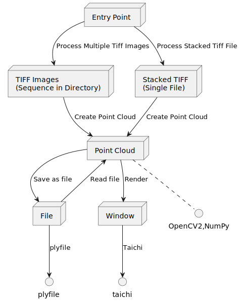

## Project to Convert Collection of Images to a File and Render the File

Will be used in *RWC* to send smaller images to a web interface.

### *UML* Diagram



#### Use:
**(Recommended) Create Virtual Environment:**
```
python3 -m venv env
```
**Install Dependencies:**
```
pip install -r requirements.txt
```
**Other Requirements**
- *tkinter:* Python interface to *Tcl/Tk*, currently for python *3.10*
- If using virtual environment
	- Start the environment with this command:
		- *source env/bin/activate --system-site-packages*
	- Or you can add code to the activate script, for me this worked, 
	should be similar for all
```sh
PYTHON_VERSION=$(python3 -c 'import sys; print(".".join(map(str, sys.version_info[:2])))')
TK_LIBRARY=$(python3-config --prefix)/lib/python${PYTHON_VERSION}/tkinter
TKPATH=$(python3-config --prefix)/lib/python${PYTHON_VERSION}/tkinter
TCL_LIBRARY=$(python3-config --prefix)/lib
export TCL_LIBRARY TK_LIBRARY TKPATH
```
```
python src/main.py
```

#### Packages Used:
* [taichi](https://github.com/taichi-dev/taichi)
* [plyfile](https://github.com/dranjan/python-plyfile)
* [opencv](https://github.com/opencv/opencv-python)

### Todo
* [ ] Make functions be *ti.kernels* and *ti.func* to speed up
* [ ] Make it work with resolutions $\neq$ $(100, 100)$
* [ ] Add color and custom render options
